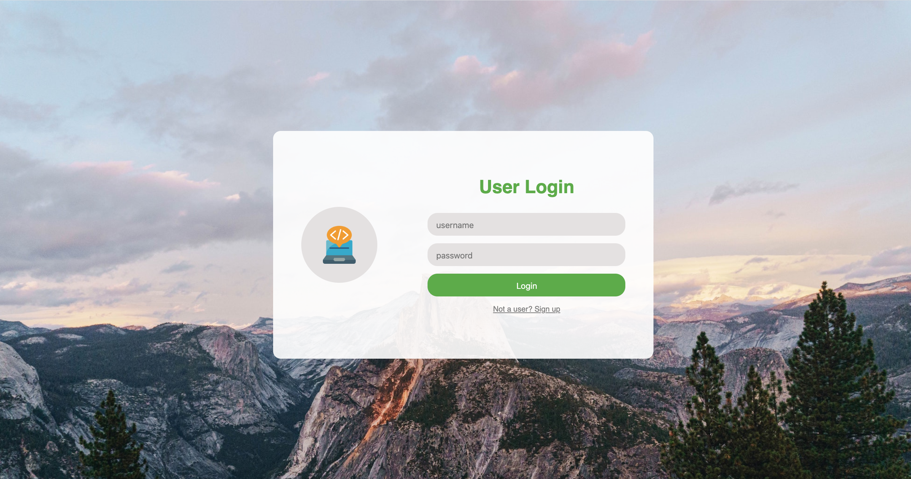

# Job X Hunter
JobXHunter is an application for job seekers to store job leads and track their job application progress.
It's a modern drag-n-drop board, consist of multiple lists. A user needs to create an account to log into the main webpage.

#### Home Page


#### Login Page


## Getting Started
1. Make a copy of the repo
```
git clone https://github.com/jshamoo/Job-X-Hunter.git
```
2. Navigate to repo directory, update and rename env file
```
cd Job-X-Hunter
// update env file
mv env .env
```

3. Install Dependencies and Set up
```
npm install
npm run build
npm start
```

## Live Website
The app is currently hosted on [heroku](https://jobxhunter.herokuapp.com)

### Logging In
- In the landing page, either sign up as a user or use the following credentials as a test user:
```
username: Jenny
password: Jenny
```

## Build With
- [React](https://reactjs.org/docs/getting-started.html)
- [Express](https://expressjs.com/en/starter/installing.html)
- [EJS](https://ejs.co/#install)
- [PassportJS](http://www.passportjs.org/docs/)
- [MongoDB/Mongoose](https://mongoosejs.com/docs/index.html)
